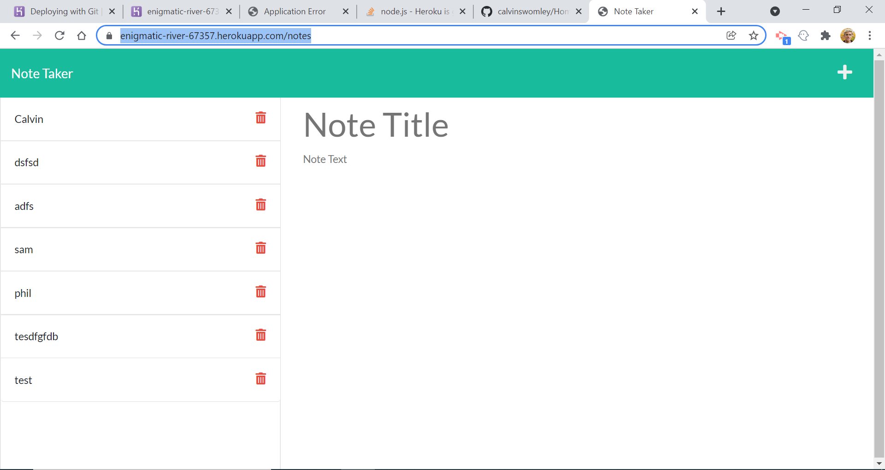

# Homework11-NoteTaker
Homework 11 Express JS: Note Taker App

## Contents
- [Description](#Description)
- [Screenshot](Screenshot)
- [Installation](#Installation)
- [Instructions](#Instructions)
- [Liscence](#Liscence)
- [Contributors](#Contributors)
- [Contacts](#Contacts)
- [Deployed Application and GitHub Repository Link](#DeployedApplicationandGitHubRepositoryLink)

## Description:
    This web application allows users to write, store and edit notes and tasks in a web browser.

    On the front end, this application uses HTML, CSS and JavaScript. The application uses Node JS and Express JS to route and connect data from the front end to the database.

## Screenshot:

## Installation
    No installation required. Access this application via web browser.

## Instructions
    1. Navigate to the deployed application link below.
    2. Click "Get Started" button to open application.
    3. Click "+" button to open blank note.
    4. Type note title and note into respective text areas.
    5. Click save button in upper right to save the note.
    6. Access or update saved notes on the left.
    
## Liscense
    MIT

## Contributors
    Calvin Swomley

## Contact:
calvinswomley@gmail.com | [https://github.com/calvinswomley](https://github.com/calvinswomley)

## Deployed Application and GitHub Repository Link
[https://enigmatic-river-67357.herokuapp.com/](https://enigmatic-river-67357.herokuapp.com/)

[https://github.com/calvinswomley/Homework11-NoteTaker](https://github.com/calvinswomley/Homework11-NoteTaker)

